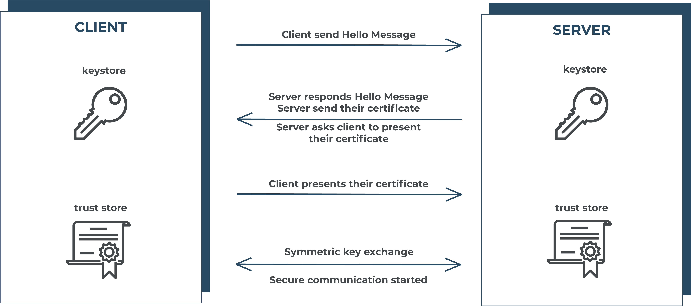

[](https://opensource.org/licenses/MIT)

# spring-x509

In cryptography, `X.509` is a standard defining the format of **public key certificates**. X.509 certificates are used 
in many Internet protocols, including `TLS/SSL`, which is the basis for `HTTPS`, the secure protocol for browsing 
the web. An X.509 certificate contains **a public key** and an **identity** (a hostname, or an organization, 
or an individual), and is either **signed by a certificate authority** or **self-signed**.

### Transport Layer Security (TLS)

`Transport Layer Security` (TLS), and its now-deprecated predecessor, `Secure Sockets Layer (SSL), are cryptographic 
protocols designed to provide communications security over a computer network. The TLS protocol aims primarily to 
provide privacy and data integrity between two or more communicating computer applications. When secured by TLS, 
connections between a client and a server should have one or more of the following properties:

- The connection is private (or secure) because symmetric cryptography is used to encrypt the data transmitted. 
The keys for this symmetric encryption are generated uniquely for each connection and are based on a shared secret that 
was negotiated at the start of the session (**TLS handshake**). The server and client negotiate the details of which 
encryption algorithm and cryptographic keys to use before the first byte of data is transmitted. The negotiation of a 
shared secret is both secure (the negotiated secret is unavailable to eavesdroppers and cannot be obtained, even by an 
attacker who places themselves in the middle of the connection) and reliable (no attacker can modify the communications 
during the negotiation without being detected).

- The identity of the communicating parties can be authenticated using public-key cryptography. This authentication can 
be made optional, but is generally required for at least one of the parties (typically the server).

- The connection is reliable because each message transmitted includes a message integrity check using a message
 authentication code to prevent undetected loss or alteration of the data during transmission.

 

### Generate the certificate

#### Self signed root CA

For signing our **server and client** side cerficates, we need first to create our self-signed root CA with the **openssl**
library.

```shell script
openssl req -x509 -sha256 -days 3560 -newkey rsa:4096 -keyout rootCA.key -out rootCA.crt
```

>**Pass used 1qaz2wsx**

#### Server certificate

After we created an root CA, we will create a new **server-side certificate** for signing them with our root CA. 
You should use **localhost** as common name (`CN`).

```shell script
openssl req -new -newkey rsa:4096 -keyout server.key -out server.csr
```

>**Pass used 2wsx3edc**

Now it's time to sign our **server.csr** with the **root CA**.

```shell script
 openssl x509 -days 30 -req -CA rootCA.crt -CAkey rootCA.key -CAcreateserial -CAserial serial -in server.csr -out server.crt
```

### Client certificate

Repeat the process of generate a new certificate, and sign with the root CA.

>**Pass used 4rfv5tgb**

### Create the keystore and trust store files

#### Keystore

A Java keystore stores private key entries, certificates with public keys or just secret keys that we may use for 
various cryptographic purposes. It stores each by an alias for ease of lookup.

Generally speaking, keystores hold keys that our application owns that we can use to prove the integrity of a message 
and the authenticity of the sender, say by signing payloads.

Usually, we'll use **a keystore when we are a server and want to use HTTPS**. During an SSL handshake, the server looks up 
the private key from the keystore and presents its corresponding public key and certificate to the client.

##### Generating

First of all, for creating the keystores based on respective certificates.

```shell script
openssl pkcs12 -export -out serverKeyStore.p12 -inkey server.key -in server.crt
```

>**Pass used 2wsx3edc**

```shell script
openssl pkcs12 -export -out clientKeyStore.p12 -inkey client.key -in client.crt
```

#### Trust store

A truststore is the opposite – while a keystore typically holds onto certificates that identify us, a truststore holds 
onto certificates that identify others.

We, the client, then look up the **associated certificate in our truststore**. If the certificate or Certificate Authorities 
presented by the external server is not in our truststore, we'll get an **SSLHandshakeException** and the connection won't 
be set up successfully.

##### Generating

Actually you don't need to generate them, for using the trust store to only communicate with a certain application, 
you should import the clientKeyStore.p12 in server's trust store, and do the opposite in the client.

>**Pass used 4rfv5tgb**

### Notes

>**You should generate new certificates for running this project.** 

### Enviroment and Tools

- Java SDK 11
- Maven 3.6.2+
- LibreSSL 2.6.5

### License

MIT LICENSE. [Click here for more information.](./LICENSE)